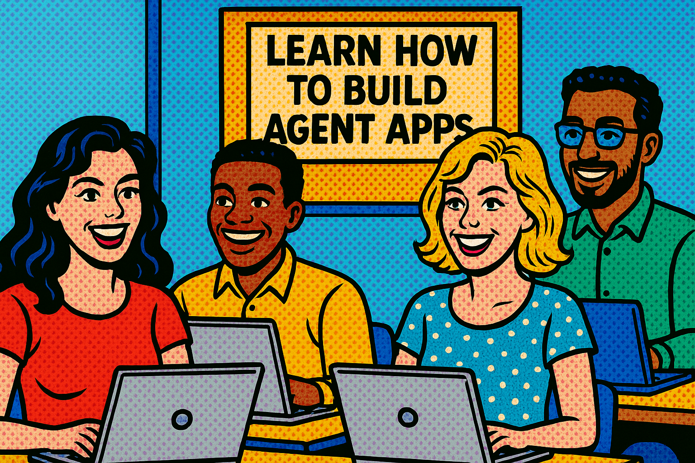

# Unlock Your Agents' Potential with Model Context Protocol PostgreSQL Workshop

The workshop documentation provides a step-by-step guide to building an AI agent using Azure AI Agents and the Model Context Protocol (MCP) with a PostgreSQL database and is published [here](https://gloveboxes.github.io/Unlock-your-agents-potential-with-Model-Context-Protocol-PostgreSQL-Workshop/).

A comprehensive workshop demonstrating how to integrate Model Context Protocol (MCP) tools with Azure AI Foundry Agents to build powerful sales analysis capabilities. This project showcases a complete enterprise-grade sales intelligence system for Zava, a fictional DIY/outdoor gear retailer.

## 📊 Workshop Scenario

You are a sales manager at **Zava**, a multinational DIY and outdoor gear retailer. Your company has built a sophisticated conversational agent powered by Azure Foundry AI Agents to help analyze sales data, understand customer preferences, and make data-driven business decisions.



This workshop demonstrates how to build such an agent from scratch, combining the power of Azure Foundry AI Agents with a comprehensive PostgreSQL database through the Model Context Protocol.

## 🚀 Key Features

- **Azure AI Foundry Agents**: Modern, cloud-native AI agent framework with streaming capabilities
- **MCP Integration**: Industry-standard Model Context Protocol for tool communication
- **Azure Database for PostgreSQL**: Enterprise-grade database with pgvector extension for AI operations
- **Comprehensive Data**: 50K+ customers, 300+ products, 200K+ orders with realistic business patterns
- **Vector Search**: AI-powered product search capabilities with PosgreSQL's pgvector extension
- **Performance Optimized**: Indexed database with sub-second query performance
- **Multi-language Support**: Localized responses in multiple languages

## 🏗️ Architecture

```text
┌─────────────────────┐    ┌─────────────────┐    ┌─────────────────┐
│   Azure AI Agent    │    │   MCP Client    │    │   MCP Server    │
│   (main.py)         │◄──►│ (mcp_client.py) │◄──►│ (mcp_server_sales_analysis.py) │
│                     │    └─────────────────┘    └─────────────────┘
│ ┌─────────────────┐ │                                   │
│ │ Azure AI        │ │                                   ▼
│ │ Agents Service  │ │                           ┌─────────────────┐
│ │ + Streaming     │ │                           │ Azure Database  |
│ │                 │ │                           │ for PostgreSQL  │
│ └─────────────────┘ │                           │       +         │
└─────────────────────┘                           │    pgvector     │
         │                                        └─────────────────┘
         ▼                                                │
┌─────────────────────┐                           ┌─────────────────┐
│ Azure OpenAI        │                           │ 8 Normalized    │
│ Model Deployment    │                           │ Tables with     │
│ (GPT-4, etc.)       │                           │ Performance     │
└─────────────────────┘                           │ Indexes         │
                                                  └─────────────────┘
```

## 📋 Prerequisites

- **Azure Subscription** with access to Azure AI Foundry and Azure OpenAI
- **Python 3.11+** (Python 3.13 recommended)
- **Docker Desktop 4.42+**
- **VS Code** with Dev Containers extension
- **Git** for version control

## 🛠️ Quick Start

### Option 1: Development Container (Recommended)

**Prerequisites:**

- Docker Desktop
- VS Code with Dev Containers extension

**Setup:**

1. **Clone the repository**:

   ```bash
   git clone https://github.com/gloveboxes/Unlock-your-agents-potential-with-Model-Context-Protocol-PostgreSQL-Workshop.git
   cd "Unlock your agents potential with Model Context Protocol PostgreSQL Workshop"
   ```

2. **Configure Environment**:
   - Copy `.env.example` to `.env`
   - Fill in your Azure AI Foundry project details:

     ```bash
     PROJECT_ENDPOINT=<your-azure-ai-foundry-endpoint>
     MODEL_DEPLOYMENT_NAME=<your-model-deployment-name>
     AZURE_BING_CONNECTION_ID=<your-bing-connection-id>
     ```

3. **Open in Dev Container**:
   - Open the folder in VS Code
   - When prompted, click "Reopen in Container" or use Command Palette → "Dev Containers: Reopen in Container"
   - The PostgreSQL database will automatically start and restore data

4. **That's it!** The dev container includes:
   - Python 3.13 environment with all dependencies
   - PostgreSQL 17 database with pgvector extension
   - Automatically restored Zava retail database (~50K customers, 200K orders)
   - All necessary VS Code extensions and tools

### Option 2: Local Development

1. **Clone the repository**:

   ```bash
   git clone https://github.com/gloveboxes/Unlock-your-agents-potential-with-Model-Context-Protocol-PostgreSQL-Workshop.git
   cd "Unlock your agents potential with Model Context Protocol PostgreSQL Workshop"
   ```

1. Create a Python virtual environment:

   On Windows:

   ```bash
   python -m venv venv
   source venv/bin/activate  # On Windows use: venv\Scripts\activate
   ```

   On macOS/Linux:

   ```bash
   python3 -m venv venv
   source venv/bin/activate
   ```

1. **Install Dependencies**:

   ```bash
   pip install -r requirements-dev.txt
   ```

2. **Setup PostgreSQL**:

   ```bash
   docker-compose up -d db
   ```

3. **Configure Environment** (same as Option 1)

## 🎓 Workshop Learning Objectives

By completing this workshop, you will learn:

1. **Azure AI Agents**: How to build and deploy conversational agents using Azure AI Foundry
2. **Model Context Protocol**: Industry-standard protocol for AI tool integration
3. **Database Design**: Normalized database schema with performance optimization
4. **Streaming Responses**: Real-time agent interactions with live updates
5. **Enterprise Patterns**: Production-ready code structure and error handling

## 🚀 Usage

### Running the Sales Analysis Agentß

Once you have the development environment set up:

1. **Start the Agent**:

   Press `F5` in VS Code or run the following command in the terminal:

   ```bash
   cd /workspace/src/python/workshop
   python main.py
   ```

2. **Interact with the Agent**:
   The agent supports rich streaming conversations with real-time responses:

   ```shell
   🤖 Zava Sales Analysis Agent Ready!
   Connected to Azure AI Foundry
   Available tools: PostgreSQL schema tools + sales query execution
   =========================================================================
   
   You: What were our top-selling product categories last quarter?
   
   Agent: Let me analyze your sales data...
   [Real-time streaming response with formatted tables and insights]
   ```

3. **Example Queries to Try**:
   - **Sales Performance**: "Show me revenue by product category for 2024 as a bar chart"
   - **Regional Analysis**: "Which stores performed best last quarter?"
   - **Customer Insights**: "Who are our top 10 customers by order value?"
   - **Product Search**: "Find products similar to camping equipment"
   - **Trend Analysis**: "Show me seasonal sales patterns"
   - **Inventory Reports**: "What's our current stock level by store?"

4. **Advanced Features**:
   - **Multi-language**: Ask questions in different languages for localized responses
   - **Data Export**: Request data in CSV format (presented as markdown tables)
   - **Complex Queries**: The agent can join multiple tables and perform sophisticated analysis

## 🖥️ Interface Options

This workshop now supports **two interface options**:

### 🖥️ Command Line Interface (Original)
Traditional terminal-based interaction for developers who prefer CLI tools.

### 🌐 **Web Application Interface (New!)**
Modern browser-based chat interface with real-time streaming and file upload capabilities.

**Quick Start - Web Interface:**
```bash
cd src/python/workshop
python main.py
# Open browser to http://127.0.0.1:8005
```

**Features:**
- 🎯 Modern web-based chat interface
- 📎 File upload and processing
- ⚡ Real-time streaming responses
- 📱 Mobile-friendly design
- 🔄 Session persistence

For complete migration details, see: [Web App Migration Guide](docs/web-app-migration.md)

## 📁 Project Structure

```text
workshop/
├── src/python/workshop/           # Main application code
│   ├── main.py                   # Azure AI Agent orchestrator
│   ├── mcp_client.py            # MCP client for tool communication
│   ├── mcp_server_sales_analysis.py            # MCP server with database tools
│   ├── sales_data_postgres.py   # PostgreSQL database access layer
│   ├── config.py                # Configuration management
│   ├── stream_event_handler.py  # Real-time streaming handler
│   ├── terminal_colors.py       # Terminal output formatting
│   └── utilities.py             # Common utilities
├── src/shared/                   # Shared resources
│   ├── database/                # Database files and tools
│   │   ├── zava_retail_2025_07_14_postgres_rls.backup  # Database backup
│   │   └── data-generator/      # Database generation scripts
│   │       ├── generate_zava_postgres.py  # PostgreSQL generator
│   │       ├── generate_customer_db.py    # SQLite generator (legacy)
│   │       ├── product_data.json         # Product catalog
│   │       └── reference_data.json       # Store and reference data
│   ├── instructions/            # Agent instruction files
│   │   ├── function_calling.txt # Sales agent instructions
│   │   └── code_interpreter.txt # Code interpreter instructions
│   └── images/                  # Product images (300+ items)
├── infra/                       # Azure infrastructure (Bicep templates)
├── scripts/                     # Utility scripts
├── .devcontainer/              # Development container configuration
├── docker-compose.yml          # PostgreSQL database service
├── pyproject.toml              # Python project configuration
└── requirements-dev.txt        # Python dependencies
```

## 🧩 Key Components

### Azure AI Agent (main.py)

The main orchestrator using Azure AI Foundry:

- **Agent Management**: Creates and manages conversational agents
- **Streaming Responses**: Provides real-time, token-by-token responses
- **MCP Integration**: Dynamically loads and manages MCP tools
- **Error Handling**: Comprehensive error handling and graceful degradation
- **Multi-language Support**: Handles localized responses

### MCP Client (mcp_client.py)

Handles communication with MCP servers following the MCP specification:

- **Session Management**: Persistent connections to MCP servers
- **Tool Discovery**: Automatically discovers available tools
- **Function Mapping**: Maps MCP tools to Azure AI Agent functions
- **Async Operations**: Full async support for optimal performance

### MCP Server (mcp_server_sales_analysis.py)

Provides comprehensive database access tools:

- **Schema Tools**: Individual table schema inspection
  - `get_customers_table_schema`
  - `get_products_table_schema`
  - `get_orders_table_schema`
  - `get_order_items_table_schema`
  - `get_categories_table_schema`
  - `get_product_types_table_schema`
  - `get_stores_table_schema`
  - `get_inventory_table_schema`
- **Query Execution**: `execute_sales_query` for PostgreSQL operations
- **Safety Features**: Query validation and result limiting

### PostgreSQL Database Layer (sales_data_postgres.py)

Enterprise-grade database access:

- **Connection Management**: Async PostgreSQL connections with pooling
- **Schema Introspection**: Dynamic table metadata discovery
- **Query Execution**: Parameterized queries with result formatting
- **Performance Optimization**: Indexed queries and connection reuse

### Stream Event Handler (stream_event_handler.py)

Real-time response handling:

- **Token Streaming**: Live token-by-token response rendering
- **Event Processing**: Handles various Azure AI Agent events
- **Progress Indicators**: Visual feedback during long operations
- **Error Display**: Real-time error reporting and handling

## 🔧 Configuration

### Azure Configuration

Configure your Azure AI Foundry connection in `.env`:

```bash
# Azure AI Foundry Project
PROJECT_ENDPOINT=https://your-project.region.api.azureml.ms
MODEL_DEPLOYMENT_NAME=gpt-4
AZURE_BING_CONNECTION_ID=your-bing-connection-id

# Optional: PostgreSQL Configuration (defaults work with dev container)
POSTGRES_HOST=localhost
POSTGRES_PORT=5432
POSTGRES_DB=zava
POSTGRES_USER=postgres
POSTGRES_PASSWORD=P@ssw0rd!
POSTGRES_SCHEMA=retail
```

### Agent Configuration

The agent behavior is configured in `config.py`:

```python
class Config:
    AGENT_NAME = "Zava Sales Agent"
    MAX_COMPLETION_TOKENS = 10240
    MAX_PROMPT_TOKENS = 20480
    TEMPERATURE = 0.1  # Low for deterministic SQL generation
    TOP_P = 0.1
```

### MCP Server Configuration

The MCP server automatically connects to PostgreSQL using environment variables and provides these tools:

- Schema inspection tools for all 8 database tables
- SQL query execution with safety validation
- Result formatting and error handling

## 📊 Database Schema

The Zava retail database is a normalized PostgreSQL database with comprehensive business data:

### Core Tables

**stores**: Store locations and identifiers

- `store_id` (Primary Key)
- `store_name` (Seattle, New York, London, etc.)

**customers**: Customer information (50,000+ records)

- `customer_id` (Primary Key)
- `first_name`, `last_name`, `email`, `phone`

**categories**: Product category master data

- `category_id` (Primary Key)
- `category_name` (Camping & Hiking, Apparel, etc.)

**product_types**: Product subcategories

- `type_id` (Primary Key)
- `category_id` (Foreign Key)
- `type_name` (Tents, Backpacks, Boots, etc.)

**products**: Product catalog (300+ products)

- `product_id` (Primary Key)
- `sku`, `product_name`, `base_price`
- `category_id`, `type_id` (Foreign Keys)
- `product_description`

### Transaction Tables

**orders**: Order headers (200,000+ records)

- `order_id` (Primary Key)
- `customer_id`, `store_id` (Foreign Keys)
- `order_date`

**order_items**: Line-item details with pricing

- `order_item_id` (Primary Key)
- `order_id`, `product_id` (Foreign Keys)
- `quantity`, `unit_price`, `discount_percent`, `total_amount`

**inventory**: Stock levels by store and product

- `store_id`, `product_id` (Composite Primary Key)
- `stock_level`

### Data Distribution

**Geographic Coverage**: 7 global regions

- North America, Europe, Asia-Pacific, China, Latin America, Middle East, Africa

**Product Categories**: 8 main categories

- Camping & Hiking, Apparel, Footwear, Water Gear, Winter Sports, Climbing, Fishing Gear, Travel

**Time Range**: 2022-2024 with realistic seasonal patterns

- Higher outdoor gear sales in spring/summer
- Increased winter sports equipment in fall/winter
- Holiday shopping spikes in Q4

**Performance Features**:

- 20+ optimized indexes for fast query performance
- Realistic business patterns and data relationships
- pgvector extension for AI-powered product search capabilities

## 🎯 Workshop Exercises

### Exercise 1: Basic Agent Setup

- Configure Azure AI Foundry connection
- Start the development container
- Run your first agent conversation

### Exercise 2: Database Exploration

- Understand the normalized database schema
- Use schema tools to explore table structures
- Execute basic queries through the agent

### Exercise 3: MCP Tool Development

- Examine the MCP server implementation
- Understand tool registration and execution
- Extend the server with custom tools

### Exercise 4: Advanced Queries

- Build complex multi-table joins
- Implement aggregation and analytics queries
- Handle error cases and edge conditions

### Exercise 5: Agent Customization

- Modify agent instructions and behavior
- Implement custom response formatting
- Add multi-language support

### Exercise 6: Production Considerations

- Implement proper error handling
- Add monitoring and logging
- Scale for enterprise deployment

## 🛡️ Error Handling & Best Practices

The workshop demonstrates enterprise-grade error handling:

### Database Layer

- **Connection Resilience**: Automatic reconnection and connection pooling
- **Query Validation**: SQL injection prevention and syntax validation
- **Result Limiting**: Automatic LIMIT enforcement to prevent large result sets
- **Transaction Management**: Proper commit/rollback handling

### MCP Layer

- **Session Management**: Graceful session creation and cleanup
- **Tool Discovery**: Dynamic tool loading with fallback behavior
- **Error Propagation**: Clear error messages from MCP server to agent

### Agent Layer

- **Streaming Errors**: Real-time error display during streaming responses
- **Graceful Degradation**: Agent continues operating when tools are unavailable
- **User Feedback**: Clear, actionable error messages for users

### Production Patterns

- **Async Operations**: Non-blocking I/O throughout the stack
- **Resource Management**: Proper cleanup of connections and sessions
- **Logging**: Structured logging for debugging and monitoring
- **Configuration Management**: Environment-based configuration

## 🤝 Contributing

This workshop is designed for learning and experimentation:

1. **Fork the repository** to your own GitHub account
2. **Create a feature branch** for your experiments
3. **Make your changes** to explore different approaches
4. **Document your learnings** in comments or additional README files
5. **Share your insights** with the community

### Workshop Extensions

Consider these advanced exercises:

- Add vector search capabilities using pgvector
- Implement caching for frequently accessed data
- Create additional MCP tools for other business functions
- Add authentication and authorization
- Build a web interface for the agent

## � Additional Resources

### Azure AI Foundry

- [Azure AI Foundry Documentation](https://docs.microsoft.com/azure/ai-services/)
- [Azure OpenAI Service](https://docs.microsoft.com/azure/openai/)
- [Azure AI Agents SDK](https://github.com/azure/azure-ai-agents)

### Model Context Protocol

- [MCP Specification](https://modelcontextprotocol.io/)
- [MCP Python SDK](https://github.com/modelcontextprotocol/python-sdk)
- [MCP Examples](https://github.com/modelcontextprotocol/examples)

### PostgreSQL & pgvector

- [PostgreSQL Documentation](https://www.postgresql.org/docs/)
- [pgvector Extension](https://github.com/pgvector/pgvector)
- [PostgreSQL Performance Tuning](https://wiki.postgresql.org/wiki/Performance_Optimization)

## 📝 License

This workshop is provided for educational purposes under the MIT License. The Zava company and sales data are fictional and created specifically for this learning experience.

## 🆘 Troubleshooting

### Common Issues

**1. Azure Authentication Errors**

```bash
# Ensure you're logged in to Azure CLI
az login --use-device-code
az account set --subscription <your-subscription-id>
```

**2. Database Connection Issues**

```bash
# Check if PostgreSQL container is running
docker-compose ps
docker-compose logs db

# Restart the database service
docker-compose restart db
```

**3. MCP Server Communication Errors**

- Verify the MCP server starts correctly: `python mcp_server_sales_analysis.py`
- Check for Python environment issues: `pip install -r requirements-dev.txt`
- Ensure all environment variables are set correctly

**4. Agent Deployment Issues**

- Verify your Azure AI Foundry project endpoint is correct
- Check that your model deployment name matches the configuration
- Ensure your Azure OpenAI deployment has sufficient quota

### Getting Help

If you encounter issues during the workshop:

1. **Check the Logs**: Review terminal output and error messages
2. **Verify Prerequisites**: Ensure all required tools and services are installed
3. **Environment Setup**: Double-check your `.env` file configuration
4. **Database Status**: Confirm the PostgreSQL database is running and accessible
5. **Azure Connectivity**: Test your Azure AI Foundry connection

### Debug Mode

Enable verbose logging for troubleshooting:

```python
# In main.py, change logging level
logging.basicConfig(level=logging.DEBUG)
```

---

**Workshop Goal**: Master the integration of Azure AI Agents with Model Context Protocol tools to build enterprise-grade conversational AI systems that can intelligently interact with complex data sources.

**Learning Path**: From basic agent setup → MCP tool integration → database operations → production patterns → advanced customization.

**Next Steps**: After completing this workshop, you'll be ready to build your own AI agents that can integrate with any data source or business system through the Model Context Protocol.
